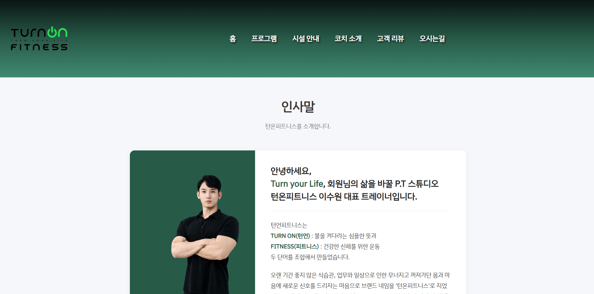

# 턴 온 피트니스(광화문점) 소개 홈페이지 제작
## 1. 프로젝트 소개 및 설정 이유
이 프로젝트는 턴 온 피트니스라는 체육관을 소개하기 위한 홈페이지를 제작하는 것으로, 웹 개발의 기본 요소를 학습하고 협업을 어떤 식으로 진행하는지 배우기 위해 진행되었다. 

-메인 이미지

## 2. 사용 기술
이 프로젝트에 사용된 기술은 다음과 같다.
- HTML5
- CSS3
- Git
- GitHub

## 3. 팀원 역할
각 팀원이 맡은 역할은 다음과 같다.

|맡은 페이지 | 이름 |
|---|---|
| 메인 페이지(header, footer) | 초이 |
| 헬스장 제공 프로그램 소개 | 정우 |
| 헬스장 시설 안내 | 정우 |
| 헬스장 코치 소개 | 서현 |
| 고객 리뷰 | 서현 |
| 오사는 길 | 초이 |

## 4. 핵심 기술
협업을 위해 브랜치를 이용해 각자의 작업을 동시적으로 진행하였다. 맡은 페이지 규모가 작아 자신의 이름으로 브랜치를 만들고 그 안에 페이지를 작성하였다.
프로젝트의 깃허브 주소는 다음과 같다: 

[GitHub web-team-project](https://github.com/choyi96/web-team-project.git)

## 5. 설정
공통으로 사용한 색상 코드와 폰트는 다음과 같다.

### 색상 코드

#091413 #285A48 #408A71 #B0E4CC

### 폰트

한글-IBM Plex Sans KR | 영어-Kanit